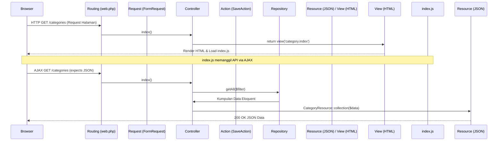

# Project Architecture Guide (project-architecture.md)

## Tujuan
Dokumen ini menjelaskan arsitektur sistem proyek berbasis arsitektur ini, termasuk struktur direktori, ketergantungan pustaka (*dependencies*), hubungan antara backend dan frontend, serta alur penanganan request dan response.

## Kapan digunakan
Gunakan dokumen ini untuk memahami bagaimana komponen-komponen utama aplikasi saling berinteraksi, dan bagaimana struktur folder dipetakan secara keseluruhan.

## Cara kerja
Proyek ini mengadopsi arsitektur Laravel monolitis hibrida dengan pemisahan tanggung jawab yang jelas:
1. **Backend (Laravel 12)**: Menangani perutean, otorisasi, validasi request via Form Request, query data via Repository, eksekusi transaksi/domain via Action, dan penyediaan data terformat via API Resource.
2. **Frontend (Vite, Blade, Tailwind CSS v4, Preline UI, jQuery)**: Menyediakan antarmuka pengguna berbasis Blade. Halaman memuat file Javascript spesifik modul yang berkomunikasi dengan backend menggunakan API client (`ApiProvider` berbasis Axios) secara asinkron (AJAX).

## Struktur
### 1. Struktur Direktori Utama
```text
project-root/
├── .ai/                       # AI Agent Knowledge Base
├── app/
│   ├── Actions/               # Kelas Domain / Logika Bisnis Penulisan (Store/Update)
│   ├── Console/Commands/      # Perintah Artisan Kustom (MakeModuleCommand)
│   ├── Helpers/               # Kelas Helper (RupiahHelper)
│   ├── Http/
│   │   ├── Controllers/       # HTTP Controllers (Menerima rute & mengembalikan View/Resource)
│   │   ├── Requests/          # Form Requests untuk Validasi
│   │   └── Resources/         # API Resources untuk standardisasi format JSON response
│   ├── Models/                # Eloquent Models
│   └── Repositories/          # Kelas Logika Kueri / Pembacaan Data
├── config/                    # Konfigurasi Laravel
├── database/
│   ├── migrations/            # Database Migrations
│   └── seeders/               # Database Seeders
├── public/                    # Aset Publik Statis (vendor JS/CSS)
├── resources/
│   ├── css/
│   │   ├── components/        # File CSS komponen terisolasi (badge, datatable, form)
│   │   ├── app.css            # Entrypoint Tailwind CSS v4
│   │   └── theme.css          # Variabel CSS :root
│   ├── js/
│   │   ├── pages/             # JS Spesifik Modul (misal: category/index.js, product/index.js)
│   │   ├── utils/             # JS Helper / Utility global (api-provider.js, datatable.js, dll)
│   │   └── app.js             # Entrypoint JS Utama
│   └── views/
│       ├── components/        # Komponen Blade reusable (datatable, cardgrid)
│       ├── layouts/           # Master layouts (main.blade.php, auth.blade.php)
│       └── [module]/          # Folder view per modul (misal: category/, product/)
├── routes/
│   └── web.php                # Rute HTTP & API utama
└── package.json & composer.json
```

### 2. Dependensi Kunci
- **Backend**: Laravel 12.x, Laravel Fortify (Autentikasi), Spatie Laravel Permission (Otorisasi), Tightenco Ziggy (Penyedia Rute ke JS), Yajra DataTables (Terinstal namun hanya digunakan untuk utilitas pembantu, kueri utama tidak memakai kueri Yajra), Spatie Laravel MediaLibrary.
- **Frontend**: Tailwind CSS v4, Preline UI v3 (Aset JS drop-down, overlay, select kustom), AlpineJS v3 (Reaktivitas form dinamis), jQuery v3.6.0 (Digunakan oleh wrapper DataTable), DataTables.net (Client-side rendering).

## Contoh implementasi
### Alur Request & Response (Modul CRUD Standard/Simple)


## Contoh kode
Berikut adalah penggambaran alur data backend yang bersih (tanpa campur aduk logika database dan controller):
```php
// App\Http\Controllers\CategoryController.php
public function index()
{
    $this->authorize('categories.view');

    if (request()->expectsJson()) {
        $filter = request('filter', 'active');
        $categories = $this->categoryRepository->getAll($filter);
        return CategoryResource::collection($categories);
    }

    return view('category.index');
}
```

## Hubungan dengan file lain
- Pola arsitektur ini memandu pembuatan berkas backend yang dibahas di `backend.md`, `controller.md`, `repository.md`, dan `resource.md`.
- Interaksi frontend dibahas di `frontend.md`, `javascript.md`, `blade.md`, dan `css.md`.

## Checklist
- [ ] Apakah setiap modifikasi folder/file baru sudah diletakkan sesuai peta direktori di atas?
- [ ] Apakah ada dependensi baru yang ingin ditambahkan? Jika ya, diskusikan terlebih dahulu sebelum instalasi.
- [ ] Apakah request AJAX Anda sudah mendeteksi format kembalian JSON dengan tepat (`expectsJson()`)?

## Best Practice
- **Data-Read Separation**: Semua kueri pembacaan data kompleks harus diletakkan di `Repositories/`.
- **Data-Write Separation**: Semua proses penulisan/penyimpanan data kompleks (misal menyimpan transaksi yang melibatkan relasi) harus dimasukkan ke `Actions/`.
- **Format Response**: Hindari mengembalikan `response()->json($model)` secara mentah. Selalu gunakan `JsonResource` untuk menstandarkan struktur response.

## Catatan penting
> [!IMPORTANT]
> Aplikasi ini tidak menggunakan pemrosesan server-side Yajra DataTables di sisi backend. Semua pemrosesan filter, pencarian, dan pagination data tabel/grid ditangani di sisi client-side oleh `datatable.js` atau `cardgrid.js` menggunakan payload JSON dari Laravel API Resource.

