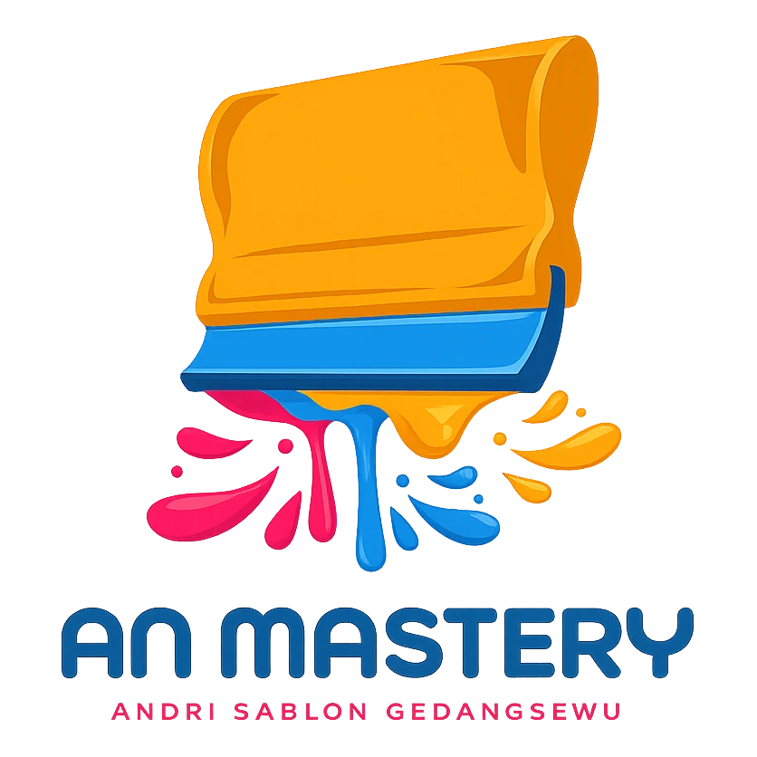
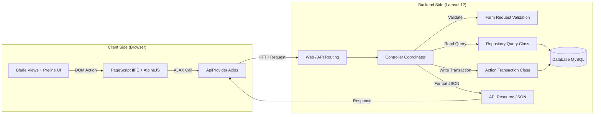

<div align="center">

  

# 🚀 AN Mastery V3

  <a href="https://git.io/typing-svg">
    
  </a>

  <br>

[](config/app.php)
[](https://laravel.com)
[](https://php.net)
[](https://tailwindcss.com)
[](https://preline.co)
[](https://alpinejs.dev)
[](LICENSE)

</div>

---

## 📌 Tentang Proyek

**AN Mastery V3** adalah platform **Sistem Manajemen Konveksi & Sablon Terpadu** yang dirancang khusus untuk operasional **Andri Sablon** (Gedangsewu, Tulungagung, Jawa Timur).

Aplikasi ini mengintegrasikan seluruh alur bisnis dari hulu ke hilir secara otomatis, presisi, dan real-time:

<table>
  <tr>
    <td width="50%">
      <h3>📦 Manajemen Operational Backend</h3>
      <ul>
        <li><b>Katalog & Stok Kain</b> — Pelacakan jenis kain, warna, dan sampel.</li>
        <li><b>Produksi Sablon</b> — Order pesanan, progres status, dan detail spesifikasi.</li>
        <li><b>Tagihan Supplier</b> — Manajemen invoice & riwayat pembayaran.</li>
        <li><b>Absensi & Gaji</b> — Rekap absensi harian dan kalkulasi gaji otomatis.</li>
      </ul>
    </td>
    <td width="50%">
      <h3>🌐 Public Showcase (Welcome Page)</h3>
      <ul>
        <li><b>Hero & Profile</b> — Branding interaktif dengan lokasi workshop.</li>
        <li><b>Production Gallery</b> — Showcase foto hasil karya dengan Lightbox.</li>
        <li><b>Fabric Showcase</b> — Katalog interaktif sampel kain & tekstur.</li>
        <li><b>Multi-Bahasa & Dark Mode</b> — Beralih Bahasa (ID/EN) & Mode Gelap.</li>
      </ul>
    </td>
  </tr>
</table>

---

## ⚡ Fitur Unggulan Sistem

```gantt
    title Alur Operasional Terpadu AN Mastery
    dateFormat  YYYY-MM-DD
    section Inventaris Kain
    Input Stok Kain           :done,    des1, 2026-01-01,2026-01-03
    section Order Sablon
    Pencatatan Pesanan        :active,  des2, 2026-01-03, 3d
    Proses Produksi Sablon    :         des3, after des2, 5d
    section Tagihan & Gaji
    Revisi Tagihan Supplier   :         des4, after des2, 4d
    Rekap Absensi & Gaji      :         des5, 2026-01-10, 2d
```

| Fitur                            | Deskripsi                                                                               | Teknologi Pendukung                                   |
| :------------------------------- | :-------------------------------------------------------------------------------------- | :---------------------------------------------------- |
| **🚀 Client-side DataTables**    | Rendering tabel instan berbasis JSON API Resource tanpa reload halaman.                 | `jQuery DataTables`, `ApiProvider`, `Axios`           |
| **🎴 Dynamic CardGrid**          | Visualisasi data berbentuk kartu interaktif asinkron untuk katalog & galeri.            | `cardgrid.js`, `Preline UI`                           |
| **🌐 Multi-Language (i18n)**     | Lokalisasi lengkap Bahasa Indonesia (`id`) & English (`en`) hingga ke objek JavaScript. | `lang.md`, `trans.js`, `lang.blade.php`               |
| **🌙 Dark & Light Mode**         | Peralihan mode tampilan otomatis / manual tersimpan di `localStorage`.                  | `toggle-dark-mode.js`, `theme.css`                    |
| **🔐 Granular Permission**       | Otorisasi hak akses berbasis Role & Permission per modul.                               | `Spatie Laravel Permission`                           |
| **📸 FilePond & Camera Capture** | Upload media terkompresi otomatis & capture foto via webcam browser.                    | `FilePond`, `camera-capture.js`, `image-processor.js` |

---

## 🛠️ Arsitektur Sistem (Hybrid Monolith)

Aplikasi dibangun menggunakan pola **Hybrid Monolith** dengan arsitektur berlapis (_Layered Architecture_) yang bersih:



---

## 💻 Tech Stack Overview

<div align="center">

| Kategori              | Teknologi Utama                                                                                                                                                                                                                                                                                                                    |
| :-------------------- | :--------------------------------------------------------------------------------------------------------------------------------------------------------------------------------------------------------------------------------------------------------------------------------------------------------------------------------- |
| **Backend Framework** |                                                                                                                          |
| **Frontend Styling**  |                                                                                           |
| **Frontend Logic**    |    |
| **Packages**          | `Spatie Permission`, `Spatie MediaLibrary`, `Laravel Fortify`, `Tightenco Ziggy`                                                                                                                                                                                                                                                   |
| **Build & Tooling**   |                                                                                                                            |

</div>

---

## 📂 Struktur Direktori Utama

<details>
<summary><b>🔍 Klik untuk melihat pohon direktori proyek</b></summary>

```text
an-mastery-v3/
├── .ai/                       # Knowledge Base & Panduan AI Agent (.ai/*.md)
├── AGENTS.md                  # AI Agent Entry Point Guide
├── app/
│   ├── Actions/               # Logika Bisnis Penulisan / Transaksi (Store/Update)
│   ├── Console/Commands/      # Artisan Command (MakeModuleCommand)
│   ├── Helpers/               # Helper Kustom (RupiahHelper)
│   ├── Http/
│   │   ├── Controllers/       # Controller HTTP & API
│   │   ├── Requests/          # Form Request Validation
│   │   └── Resources/         # API Resources untuk Standarisasi JSON Response
│   ├── Models/                # Eloquent Models
│   └── Repositories/          # Logika Kueri Pembacaan Data
├── database/
│   ├── migrations/            # Migrasi Skema Database
│   └── seeders/               # Data Awal / Seeder
├── lang/
│   ├── en/                    # Kamus Bahasa Inggris (welcome.php, models.php, dll)
│   └── id/                    # Kamus Bahasa Indonesia (welcome.php, models.php, dll)
├── public/
│   ├── assets/                # Logo (.webp, .ico) & Gambar Statis
│   └── js/ & css/             # Library Javascript & CSS Publik
├── resources/
│   ├── css/                   # Stylesheet Tailwind CSS v4 & Custom Component CSS
│   ├── js/                    # Javascript Spesifik Modul & 30+ Utilities (ApiProvider)
│   └── views/                 # Blade Layouts, Components, & View per Modul
└── routes/
    └── web.php                # Perutean Web & API Utama
```

</details>

---

## 🚀 Langkah Instalasi & Pengoperasian Lokal

1. **Clone Repositori & Masuk ke Direktori**:

    ```bash
    git clone https://github.com/RendyAFS/an-mastery-v3.git
    cd an-mastery-v3
    ```

2. **Instal Dependensi PHP & JavaScript**:

    ```bash
    composer install
    npm install
    ```

3. **Konfigurasi Environment (`.env`)**:

    ```bash
    cp .env.example .env
    php artisan key:generate
    ```

    > Sesuaikan variabel `DB_DATABASE`, `DB_USERNAME`, dan `DB_PASSWORD` dengan kredensial database lokal Anda.

4. **Jalankan Migrasi & Seeder Database**:

    ```bash
    php artisan migrate --seed
    ```

5. **Jalankan Server Pengembang**:

    ```bash
    # Jalankan Vite Hot Module Replacement (HMR)
    npm run dev

    # Jalankan Web Server Laravel (Terminal terpisah)
    php artisan serve
    ```

    Aplikasi dapat diakses melalui browser di `http://127.0.0.1:8000`.

---

## 🏷️ Pengaturan & Pengecekan Versi Aplikasi (App Version & PWA)

Versi aplikasi dikelola secara terpusat dan otomatis tersinkronisasi ke seluruh komponen antarmuka pengguna serta Service Worker PWA.

### 1. Cara Mengatur / Mengubah Versi

Set variabel versi di file `.env` (atau di [`config/app.php`](file:///D:/laragon/www/an-mastery-v3/config/app.php)):

```env
APP_VERSION=1.1.9
```

### 2. Lokasi Tampilan Versi di Aplikasi

Nilai versi aplikasi secara otomatis muncul di:

- **Navbar Header** (di bawah logo _AN Mastery_)
- **Sidebar Navigation** (di bawah logo _AN Mastery_)
- **Splash Screen Loader** (saat pemuatan aplikasi)
- **Footer Landing Page**
- **Dynamic PWA Service Worker** (`/sw.js` -> `CACHE_NAME = "an-mastery-v1.1.9"`)

### 3. Cara Mengecek Versi via Terminal / CLI

Anda dapat memeriksa versi aplikasi yang sedang aktif dari terminal menggunakan perintah Artisan:

```bash
php artisan config:show app.version
```

---

## 📄 Lisensi & Kredit

<div align="center">

Hak Cipta © 2026 **AN Mastery** — Dibuat untuk **Andri Sablon, Gedangsewu — Tulungagung**.<br>
_Designed with precision & engineered for performance._

</div>
