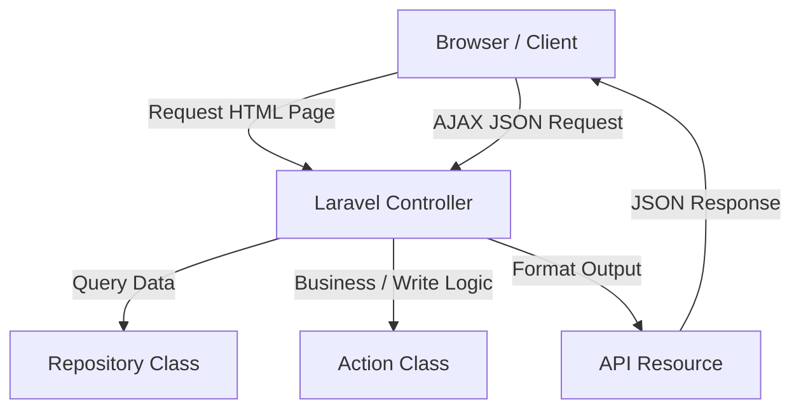

<p align="center">
  
</p>

<h1 align="center">AN Mastery V3</h1>

<p align="center">
  <b>Sistem Manajemen Konveksi Sablon — Andri Sablon Gedangsewu</b><br>
  <i>Integrated Convection Management System (Fabric Inventory, Screen Printing Orders, Supplier Billing, Employee Salaries & Attendance)</i>
</p>

<p align="center">
  
  
  
  
  
</p>

---

## 📌 Tentang Proyek

**AN Mastery V3** adalah aplikasi sistem manajemen konveksi terpadu yang dirancang khusus untuk operasional **Andri Sablon** yang berlokasi di Gedangsewu, Tulungagung, Jawa Timur. 

Aplikasi ini mengintegrasikan seluruh alur kerja bisnis konveksi dan sablon dari hulu ke hilir: pengelolaan inventaris kain, pencatatan order pekerjaan sablon, manajemen tagihan supplier, rekap kehadiran karyawan, hingga kalkulasi gaji otomatis. Selain fitur internal manajemen, aplikasi ini dilengkapi halaman publik (**Welcome Page**) yang menyajikan profil bisnis, galeri hasil produksi, katalog bahan kain, serta peta lokasi workshop.

---

## 🌐 Preview Halaman Depan (Welcome Page)

Halaman depan (`welcome.blade.php`) didesain modern, dinamis, dan responsif dengan fitur-fitur utama sebagai berikut:

* **Hero Section & Brand Identity**: Menyajikan tagline utama *"Dikelola dengan Presisi / Woven with Precision"*, penunjuk lokasi, serta akses cepat ke halaman Login/Register dan Dasbor.
* **Galeri Produksi (Production Gallery)**: Showcase foto hasil produksi sablon dan konveksi nyata yang diunggah dari sistem, dilengkapi fitur **Lightbox Modal** untuk melihat gambar ukuran penuh.
* **Katalog Kain (Fabric Showcase)**: Katalog interaktif yang menampilkan contoh bahan kain, warna, dan tekstur yang tersedia di konveksi.
* **Statistik & Ringkasan Fitur**: Card statistik (Jumlah Supplier, Karyawan, Modul, Bahasa) dan ringkasan fitur utama sistem.
* **Lokasi Workshop (Google Maps Embed)**: Section peta interaktif lokasi workshop *Andri Sablon Gedangsewu* yang responsif (aspek rasio 16:9), dilengkapi info alamat lengkap dan link langsung ke Google Maps.
* **Fitur Tambahan**: Dukungan **Multi-Bahasa (Bahasa Indonesia & English)** serta **Tema Dark / Light Mode** yang dapat diganti secara langsung dari navbar.

---

## ✨ Fitur Utama Sistem

### 📦 Management & Back-Office
1. **Inventaris & Katalog Kain**: Kelola jenis kain, varian warna, dan sampel gambar kain.
2. **Order & Produksi Sablon**: Pencatatan pekerjaan sablon, pelacakan status pengerjaan, dan riwayat pesanan.
3. **Tagihan Supplier (Supplier Billing)**: Pengelolaan invoice dan status pembayaran ke supplier secara teratur.
4. **Manajemen Karyawan & Gaji**: Manajamen data karyawan, absensi harian, dan perhitungan gaji mingguan/bulanan.
5. **Manajemen Absensi (Attendance)**: Pencatatan kehadiran harian karyawan yang tersinkronisasi otomatis dengan modul penggajian.
6. **Galeri Produksi**: Manajemen unggahan foto produk dan hasil karya konveksi.

### ⚙️ Fitur Sistem & UX
* **Client-side DataTables & CardGrid**: Rendering tabel dan grid kartu dinamis berbasis JSON API Resource yang cepat tanpa perlu reload halaman.
* **Multi-Language Support**: Dukungan penuh Bahasa Indonesia (`id`) dan English (`en`).
* **Dark / Light Mode**: Peralihan mode tampilan yang tersimpan di localStorage browser.
* **Multi-Role & Access Control**: Pengaturan hak akses granular menggunakan Spatie Laravel Permission.

---

## 🛠️ Teknologi & Arsitektur

Aplikasi ini menggunakan pendekatan **Hybrid Monolith** dengan pemisahan tanggung jawab (*Separation of Concerns*) yang ketat:



### Stack Teknologi:
* **Backend**: Laravel 12.x, Laravel Fortify (Autentikasi), Spatie Laravel Permission (Otorisasi), Spatie Laravel MediaLibrary (Manajemen Media/Gambar), Tightenco Ziggy (Route Helper untuk Javascript).
* **Frontend**: Blade Templating, Tailwind CSS v4, Preline UI v3 (Komponen UI/Overlay/Dropdown), AlpineJS v3 (Reaktivitas Form Dinamis), jQuery v3.6.0 & DataTables.net (Tabel Data Client-Side), Lucide Icons.

---

## 📁 Struktur Direktori Utama

```text
an-mastery-v3/
├── .ai/                       # Knowledge Base & Panduan AI Agent
├── AGENTS.md                  # AI Agent Entry Point Guide
├── app/
│   ├── Actions/               # Logika Bisnis Penulisan / Transaksi (Store/Update)
│   ├── Console/Commands/      # Artisan Command (MakeModuleCommand)
│   ├── Helpers/               # Helper Kustom (RupiahHelper)
│   ├── Http/
│   │   ├── Controllers/       # Controller HTTP & API
│   │   ├── Requests/          # Form Request Validation
│   │   └── Resources/         # API Resources untuk Standarisasi JSON Response
│   ├── Models/                # Eloquent Models
│   └── Repositories/          # Logika Kueri Pembacaan Data
├── database/
│   ├── migrations/            # Migrasi Skema Database
│   └── seeders/               # Data Awal / Seeder
├── lang/
│   ├── en/                    # Kamus Bahasa Inggris (welcome.php, auth.php, dll)
│   └── id/                    # Kamus Bahasa Indonesia (welcome.php, auth.php, dll)
├── public/
│   ├── assets/                # Logo (.webp, .ico) & Gambar Statis
│   └── js/ & css/             # Library Javascript & CSS Publik (jquery, datatables, lucide)
├── resources/
│   ├── css/                   # Stylesheet Tailwind CSS v4 & Custom Component CSS
│   ├── js/                    # Javascript Spesifik Modul & Utilities (ApiProvider)
│   └── views/                 # Blade Layouts, Components, & View per Modul
└── routes/
    └── web.php                # Perutean Web & API
```

## 📄 Lisensi & Kredit

Hak Cipta © 2026 **AN Mastery** — Dibuat untuk **Andri Sablon, Gedangsewu — Tulungagung**. Seluruh hak cipta dilindungi.
